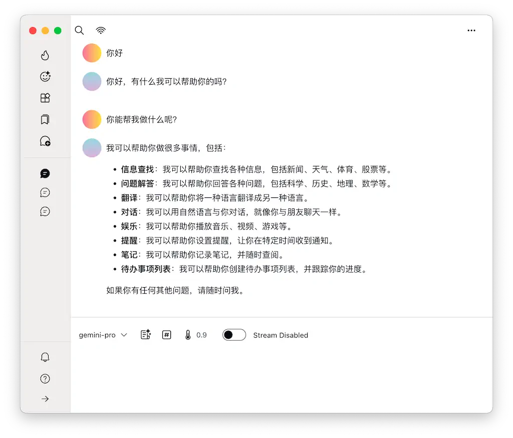

# 利用腾讯云云函数访问 Gemini Pro

1. 首先你需要一个腾讯云账号，没有的话先[注册一个](https://curl.qcloud.com/JzA89r9Y);

2. 进入云函数控制台： https://console.cloud.tencent.com/scf/list

3. 依次点击【新建】->【从头开始】，然后按照以下配置创建一个云函数

  * 函数类型： Web函数
  * 函数名称：gemini-proxy （请随意）
  * 地域： 硅谷 （或美国其他区域）
  * 运行环境：Nodejs 16.13（或者更高的版本）
  * 高级配置:
    * 内存：64M
    * 执行超时时间：900 秒
    * 请求多并发：2 并发
 * 日志配置 -> 日志投递：不启用
 * 函数代码：本地上传zip包 （[下载 ZIP 包](https://github.com/GenNomad/gemini-scf-proxy/releases/download/v1.0.0/gemini-scf-proxy.zip)）
 * 触发器配置（这里可能要创建一个新的触发器）：
    * 默认触发器
    * 触发别名/版本：默认流量
    * 请求方法：ANY
    * 发布环境：发布
    * 鉴权方法：免鉴权

然后点击“完成”按钮，进入【函数管理】，在【函数代码】中找到【访问路径】， 类似
```
https://service-43fsa347fs-423324234932.usw.tencentapigw.com/release/
```
这就是你的访问地址， 注意使用的时候要把最后的 `/release` 部分删除。

# 如何使用

你应该已经有了一个 Gemini Pro 的 API key， 如果没有的话可以[这里](https://ai.google.dev/)获取（请科学上网）。

你现在需要的只剩一个可以适配 Gemini Pro 的客户端应用了。 这里我们推荐自家的 5ire， Mac 和 Windows 用户都可以使用，不过目前还在内测阶段，需要的话请联系我们。

效果如下

